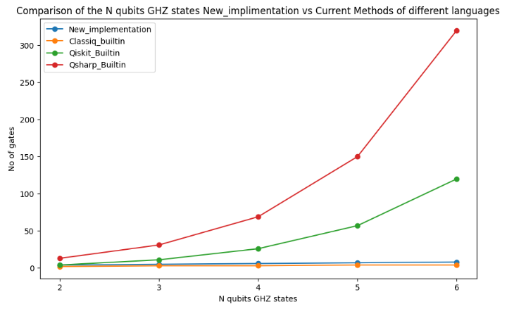
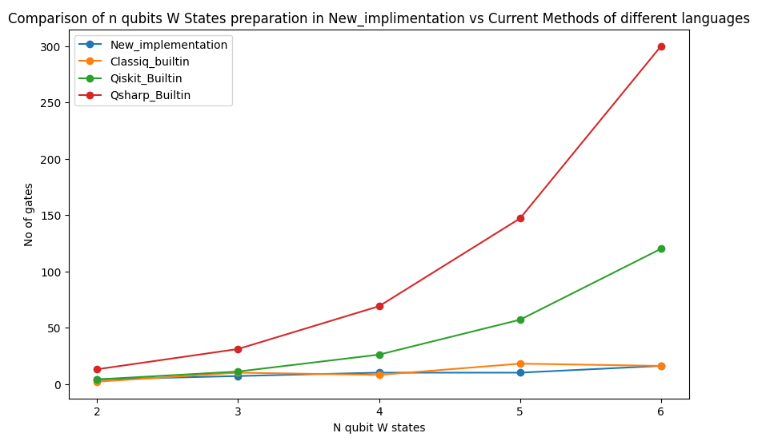

# Quantum-Sparse-State-Preparation
This reporsitory is the submission of the QRE-2024-Challange.

## Introduction 
Welcome to the implementation of Quantum Sparse state preparation algorithm!
This project is the implementation of the research paper [An Efficient Algorithm for Sparse Quantum State Preparation](https://htor.inf.ethz.ch/publications/img/quantum_dac.pdf) by Niels Gleinig and Torsten Hoefle.

## Installation

In order to work with the jupyter notebook of this project `Quantum_sparse_state_prepation.ipynb`, you need a number of packages. The first cell of each language implementation is about the installation of different packages and modules therein. Running these cells of each section ensure that you are all setup with the environment. The only prerequisite is that you have `python` installed and any IDE that runs `.ipynb` notebook file i.e Visual studio code or jupyter notebook.

## Implementation

The file accompained within this reprsitory named as `Project_Report.pdf` contains all the detailed discussion about the main result of the paper "An Efficient Algorithm for Sparse Quantum State Preparation", the implementation procedure of this paper and the results of implemetation in different langauges i.e `Classiq` , `Qsharp` and `qiskit`. Below we provide a brief explanation for the algorithm.

### Input
The input of the algorithm is the classical description of a quantum state i.e we are providing non zero basis states with their respective coefficients.

```[[Basis-1], Probability], [[Basis-2], Probability] , [[Basis-3], Probability]]```

### Output

The outcome of the algorithm is the circuit C having the property when applies to a all zero state provide us the required quantum state.

## Results

### Simulation
The results of the implementation of the above discussed paper in Classiq, QSharp and Qiskit along with the buitin method for state preparation in these languages is shown in graph below. One an easily see that the result of the implementation are promisisng relative t current method of preparing states in Classiq, QSharp and Qiskit. 
> Note that our new implmentation has independent of the language and require the same number of gates irrespective of the langauage used.






### Quantum Resource Estimation

The results from the resource estimation are consistents with the simulation results, the number of qubits in each case wheateher this new implementation of the paper and the builtin methods of generating states remains same throughout. The other parameters (like number of logical depth, runtime and No of T gates etc ...) are much less in the new implementation compare to the builtin methods of langauages (i.e qiskit and Qsharp). The below graphs are showing theses claims:

> We used Microsoft Quantum Resourse Estimator for our project to do QRE.


## License

Most of the work of the project is done under the classiq project available in github reporsitory https://gitlab.com/qworld/qeducation/qcourse551-1/-/issues/7 about a six months ago.

Both of the reporsitories code and material license under the following regulation Accessing and copying code from these repositories without authorization of authors is illegal.

The text and figures are licensed under the Creative Commons Attribution 4.0 International Public License (CC-BY-4.0), available at https://creativecommons.org/licenses/by/4.0/legalcode.

The code snippets in the notebooks are licensed under Apache License 2.0, available at http://www.apache.org/licenses/LICENSE-2.0.
